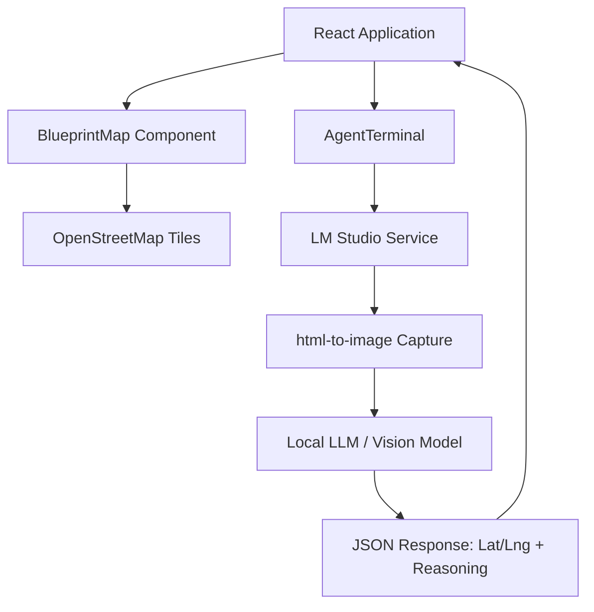

# Urban Recon 🛰️

**Urban Recon** is a specialized city recognition challenge where an AI vision agent identifies world cities based on dynamic, label-free OpenStreetMap blueprints. By analyzing urban planning signatures—radial street layouts, geometric grids, and canal systems—the agent attempts to geolocate itself with high precision.


## 🌟 Features

- **Dynamic Map Blueprints**: No static images. Real-time mapping data filtered to remove all textual labels, icons, and markers.
- **AI Intelligence Loop**: Integrates with local vision models (via LM Studio) to perform visual "reconnaissance" on map layouts.
- **Urban Planning Logic**: The agent reasoning is driven by specialized prompts focusing on historical city planning (e.g., Haussmann's Paris, L'Enfant's D.C.).
- **Interactive Terminal**: Retro-terminal UI for monitoring agent "thinking" process, distance calculations, and evaluative feedback.

## 🛠️ Technology Stack

- **Frontend**: React 19 + TypeScript + Vite 6
- **Maps**: Leaflet.js + OpenStreetMap (CartoDB Voyager No Labels)
- **Styling**: Tailwind CSS 4 + Framer Motion
- **Vision Integration**: LM Studio (Local OpenAI-compatible API)
- **Utilities**: `html-to-image` for live map capture

## 🏗️ Architecture



## 🚀 Getting Started

### Prerequisites

- **Node.js**: v18+
- **LM Studio**: Running on port `1234` with a vision-capable model (e.g., `qwen2-vl-7b`, `llama-3.2-vision`).

### Setup

1. **Clone & Install**:
   ```bash
   git clone https://github.com/harishkotra/urban-recon.git
   cd urban-recon
   npm install
   ```

2. **Run Dev Server**:
   ```bash
   npm run dev
   ```

3. **Configure Map**: Open `localhost:3000`, ensure LM Studio is running, and click **START_MISSION**.

## 🤝 Forking & Contributing

We welcome contributions! To fork and add features:

1. **Fork the repo** and create your branch: `git checkout -b feature/cool-new-idea`.
2. **Add New Cities**: Update `src/locations.ts` with new coordinates and urban planning hints.
3. **Enhance UI**: Add more pixel-art animations or new agent personas.
4. **Local Model Adapters**: Add support for Ollama or other local inference engines.
5. **Multi-Agent Mode**: Allow two agents to compete in a geoguessing duel.

### Ideas for Contributors
- [ ] **Density Heatmaps**: Add a layer for population or zoning density.
- [ ] **Historical Maps**: Toggle between modern OSM and 19th-century planning maps.
- [ ] **Agent Persona Selection**: Choose between "Historian", "Urban Planner", or "Spy".
